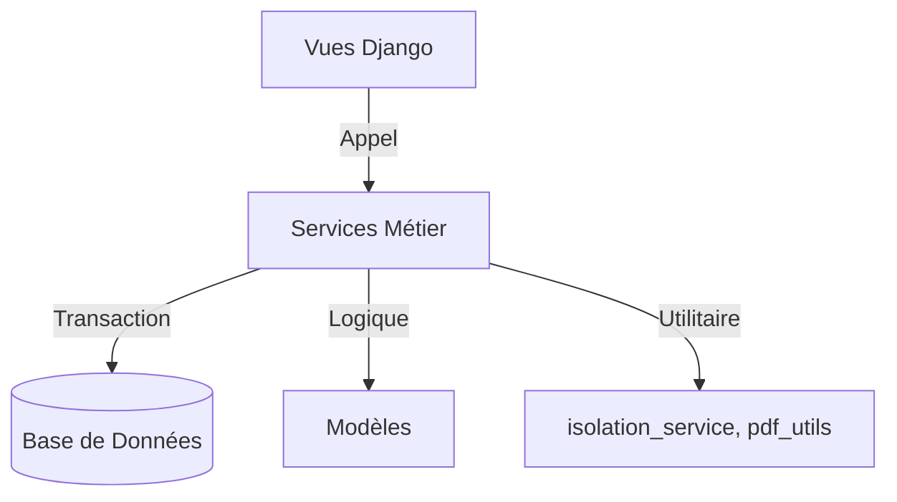

# 📘 API Interne des Services Métier - Stock

Ce document détaille l'architecture, les signatures et les règles d'utilisation des services métier du module `stock`. Il est destiné aux développeurs pour la maintenance et l'évolution de l'application.

---

## 🏗️ Architecture Globale

Les services sont organisés selon une architecture en couches :
1. **Vues (Views)** : Gèrent les requêtes HTTP, la validation des formulaires et l'affichage.
2. **Services Métier** : Contiennent la logique métier complexe, les transactions atomiques et les règles de gestion.
3. **Modèles (Models)** : Représentation des données et logique de persistance basique.

**Principe clé :** Les vues ne doivent jamais contenir de logique métier complexe. Elles délèguent tout traitement aux services.



---

## 🔐 Règles Transverses

### Gestion des Transactions
Tous les services modifiant des données utilisent le décorateur `@transaction.atomic()`. En cas d'erreur, toutes les opérations sont annulées (rollback).

### Isolation par Magasin
Avant toute opération, vérifier les permissions avec `isolation_service` :
```python
from stock.services.isolation_service import verifier_acces_magasin, get_magasins_autorises

# Vérifier si l'utilisateur a accès à un magasin spécifique
verifier_acces_magasin(request.user, magasin_id)

# Obtenir la liste des magasins autorisés pour filtrer les requêtes
magasins = get_magasins_autorises(request.user)
articles = Article.objects.filter(magasin__in=magasins)
```

### Gestion des Erreurs
Les services lèvent des exceptions spécifiques (`ValueError`, `PermissionError`) qui doivent être capturées dans les vues pour afficher des messages utilisateur appropriés.

---

## 📦 1. BonService (`bon_service.py`)

Gère le cycle de vie complet des documents de mouvement (BS, BE, BR, BSHS).

**Classe principale :** `BonService`

### Méthodes Principales

#### `creer_bon_sortie(data, user, magasin)`
Crée un Bon de Sortie (BS).
- **Paramètres** :
  - `data` (dict) : `{lignes: [{article_id, qte}], beneficiaire_id, motif}`
  - `user` (User) : Utilisateur créateur.
  - `magasin` (Magasin) : Magasin source.
- **Retour** : Instance de `BonMouvement`.
- **Règles** :
  - Vérifie le stock disponible (FIFO/Péremption).
  - Réserve le stock (statut `BROUILLON`).
  - Génère le numéro via `CompteurService`.

#### `creer_bon_entree(data, user, magasin)`
Crée un Bon d'Entrée (BE) ou Réception.
- **Paramètres** :
  - `data` (dict) : `{lignes: [{article_id, qte, prix_unitaire}], fournisseur_id, num_bl}`
  - `user`, `magasin`.
- **Règles** :
  - Met à jour le stock (ajout).
  - Recalcule le **CMUP** (Coût Moyen Unitaire Pondéré).
  - Crée les lots si activés.

#### `valider_bon(bon_id, user, commentaire=None)`
Valide un bon en attente.
- **Règles** :
  - Vérifie le circuit de validation.
  - Bloque la modification du bon.
  - Débite définitivement le stock (pour les sorties).

#### `annuler_bon(bon_id, user, motif_id)`
Annule un bon validé.
- **Règles** :
  - Crée un mouvement inverse (contre-passation).
  - Nécessite un motif obligatoire.

#### `generer_hash_preuve(bon)`
Génère un hash SHA-256 unique pour la traçabilité légale du document.

---

## 🔄 2. StockTransactionService (`stock_transaction_service.py`)

Gère les mouvements atomiques de stock hors documents complexes (ajustements directs, transferts).

**Classe principale :** `StockTransactionService`

### Méthodes Principales

#### `ajouter_stock(article, magasin, quantite, lot=None, peremption=None, cout=None)`
Ajoute du stock directement.
- **Retour** : Instance de `Mouvement` (Type: AJUSTEMENT_POSITIF).
- **Règles** : Met à jour `StockItem` ou le crée. Recalcule CMUP si `cout` fourni.

#### `retirer_stock(article, magasin, quantite, motif="")`
Retire du stock.
- **Règles** : Lève `ValueError` si stock insuffisant. Utilise FIFO (First In First Out) sur les lots.

#### `transférer_stock(article, qte, magasin_src, magasin_dest, user)`
Transfère du stock entre deux magasins.
- **Règles** : Transaction atomique (retrait src + ajout dest). Si échec sur dest, rollback sur src.

#### `calculer_cmup(article, magasin)`
Calcule le nouveau CMUP après une entrée.
- **Formule** : `(AncienStock * AncienPrix + NouveauStock * NouveauPrix) / TotalStock`

---

## 🚚 3. LivraisonService (`livraison_service.py`)

Gère les livraisons partielles des commandes fournisseurs.

**Classe principale :** `LivraisonService`

### Méthodes Principales

#### `creer_livraison_partielle(commande_id, data, user)`
Crée une livraison partielle pour une commande.
- **Data** : `{lignes: [{ligne_commande_id, qte_livree}]}`.
- **Règles** : Vérifie que `qte_livree <= qte_restante`.

#### `valider_reception(livraison_id, user)`
Valide la réception physique.
- **Action** : Appelle `BonService.creer_bon_entree()` pour intégrer le stock.

#### `generer_accuse_reception(livraison_id)`
Génère le document PDF d'accusé de réception.

---

## 📝 4. InventaireService (`inventaire_service.py`)

Gère les campagnes d'inventaire et les régularisations.

**Classe principale :** `InventaireService`

### Méthodes Principales

#### `creer_campagne(nom, magasin, type_inv, date_debut, date_fin)`
Initialise une campagne.
- **Types** : `GENERAL`, `PAR_FAMILLE`, `PERSONNALISE`.
- **Action** : Génère les `LigneInventaire` avec le stock théorique actuel ("figé").

#### `saisir_comptage(ligne_id, qte_comptee, user)`
Enregistre un comptage réel.
- **Calcul** : Détermine l'écart (`Réel - Théorique`).

#### `valider_campagne(campagne_id, user)`
Clôture la campagne.
- **Action** : Génère automatiquement les `Ajustement` pour les écarts constatés.

---

## 🔢 5. CompteurService (`compteur_service.py`)

Garantit l'unicité et la séquentialité des numéros de documents.

**Classe principale :** `CompteurService`

### Méthodes Principales

#### `get_next_numero(type_doc, magasin, annee=None)`
Récupère le prochain numéro disponible.
- **Mécanisme** : Utilise `select_for_update()` pour verrouiller la ligne en base et éviter les doublons en concurrence.
- **Format** : `PRÉFIXE-MAGASIN-ANNÉE-NUMÉRO` (ex: `BS-01-2024-0045`).

---

## 🛡️ 6. IsolationService (`isolation_service.py`)

Gère la sécurité d'accès aux données par magasin.

### Fonctions Principales

#### `get_magasins_autorises(user)`
Retourne la liste des IDs de magasins accessibles.
- **Superuser** : Tous les magasins.
- **Utilisateur standard** : Ceux liés à son `Profil`.
- **Sans profil** : Liste vide.

#### `verifier_acces_magasin(user, magasin_id)`
Lève `PermissionError` si l'utilisateur n'a pas accès au magasin.

#### `filtrer_par_magasins(queryset, user, champ='magasin')`
Applique automatiquement le filtre `.filter(magasin__in=magasins_autorises)` sur un QuerySet.

---

## 🖨️ 7. PdfGenerationService (`pdf_utils.py` & `DocumentGenerator`)

Génération des documents PDF.

### Hiérarchie de Configuration
1. **ModeleDocumentMagasin** : Spécifique au magasin (priorité max).
2. **ConfigDocument** : Globale par type de document.
3. **Défaut** : Valeurs en dur dans le code.

### Utilisation
```python
from core.pdf_service import DocumentGenerator
from stock.pdf_utils import get_pdf_config

config = get_pdf_config('BS', magasin)
generator = DocumentGenerator(template='bs_template.html', context=data, config=config)
pdf_bytes = generator.render_bytes()
```

---

## 🧩 Exemple d'Usage Complet (Création BS)

```python
from stock.services.bon_service import BonService
from stock.services.isolation_service import verifier_acces_magasin
from django.db import transaction

def vue_creer_bs(request):
    if request.method == 'POST':
        magasin_id = request.session.get('magasin_actif')
        
        # 1. Sécurité
        verifier_acces_magasin(request.user, magasin_id)
        magasin = Magasin.objects.get(id=magasin_id)
        
        try:
            with transaction.atomic():
                # 2. Appel Service
                bon = BonService.creer_bon_sortie(
                    data=request.POST.dict(),
                    user=request.user,
                    magasin=magasin
                )
                # 3. Succès
                return redirect('detail_bon', pk=bon.id)
        except ValueError as e:
            # 4. Gestion Erreur Métier
            messages.error(request, str(e))
```

---

## 🆘 Guide de Dépannage

| Erreur | Cause Probable | Solution |
|--------|----------------|----------|
| `IntegrityError: duplicate key` | Concurrency sur numéro | Vérifier `CompteurService` (lock DB) |
| `StockInsufficientError` | Stock < Demande | Vérifier les lots/péremptions disponibles |
| `PermissionError` | Isolation magasin | Vérifier `Profil.magasins_autorises` |
| `CMUP incohérent` | Prix nul à l'entrée | Forcer `prix_unitaire > 0` lors de la création BE |

---

*Document généré automatiquement - Mainteneur : Équipe Technique*
